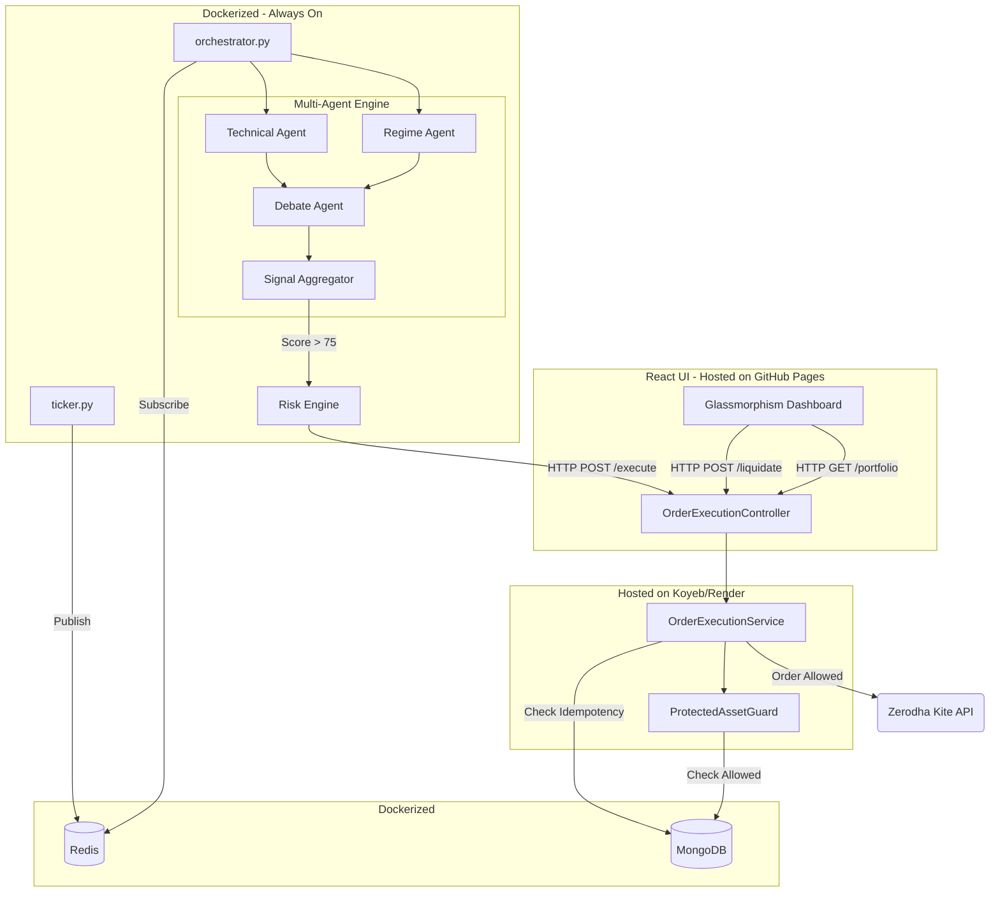

# AI Autonomous Trading Platform

A massive, defense-in-depth, fully autonomous algorithmic trading bot designed for the Indian Stock Market (NSE) using Zerodha's API.

## Architecture

## Features
- **Deterministic Multi-Agent AI**: Uses Technical and Regime models to debate trades. No LLM hallucination.
- **Risk Firewall**: Mathematical position sizing enforcing max `0.5%` risk per trade.
- **Protected Asset Guard**: The Java backend inherently rejects any sell signals attempting to touch your baseline long-term mutual funds or core equities.
- **Event-Driven**: The system subscribes to live Redis ticks, converting them into 1-minute actionable candles.

## Getting Started

See `learning/19-local-testing-guide.md` to spin up the entire 5-container architecture locally using Docker Compose!
